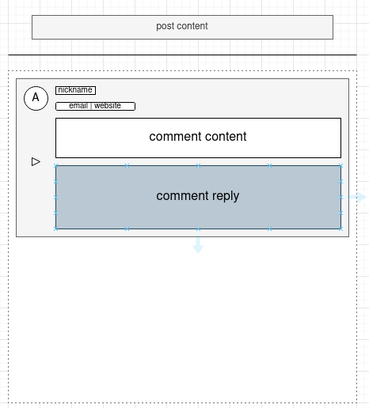

### Design

`Comments System`为评论系统, 这不论在什么应用下都成为了必不可少的一环, 如果需要在程序中加入社交属性, 那么评
论系统就是必不可少的. 如何尽可能高效地以某种模式快速开发出`Comment System`是一种较为经典的接触高并发的学习方
式. 面向并发级别较低的blog, 通常直接采用二段回复式实现即可, 减少复杂性和开发周期. 面向并发级别高的在线评论系统, 则允许采用多级回复实现, 但是需要借助各种提速手段稳定线上运行. 

主要记录面向blog式和面向live stream式. 

#### Blog Comment System

面向blog式的comment system往往没有面向live stream系统那么高的并发量, 同时也不需要很复杂的用例设计. 核心实体围绕基本信息展示和评论主体内容来构建, 更多作为嵌入页面的轻量级系统来实现, 但是从本质上依然是完整的c/s模式实现. 

关于技术选型, 不论是小型还是大型评论系统, 业界统一都采用nosql进行, comment system在blog级别下并发量极低, 而且不存在一般需要的事务行为, 因此诸如mongo这样的nosql可以完美用于comment的存储. 同时, 针对blog的评论系统基本不需要用户登录后使用, 因为这个时候的评论可能只是一个临时的问题或者想法, 无须长期的登录维护, 因为我们不会长时间停留在一个post下面尝试处理某个问题. 不过为了一些可能的恶意评论的抵挡, 可以使用一些特殊字段来标识进行过滤, 例如邮箱. 信息收集得不要太多, 而且都要显示在可见的控件下. 一般小型的blog可以使用redis进行设计内容加速, 但是考虑到可以不设计like, 因此也可以不进行cache加速, 但是为了blog中的评论有效性, like设计往往会显示. 后面以`web server, mongo, redis`主要来介绍构建. 

```
[comment schema]
comment_id  --> uuid
user_id ref user.user_id --> uuid
reply_id ref comment.comment_id --> uuid
post_id ref post.post_id --> uuid
timestamp --> time
deleted --> bool
content --> binary
[user schema]
user_id --> uuid
user_key --> string
nickname --> string
email --> string
website --> string
avatar --> string | binary
```

最终效果显示样例:


从运用原理上而言, 由于s端不会存储任何可能的用户状态, 因此用户每次都可以采用不同的身份进行发表评论. 但是在为了方便的前提下, 用户可以借助一个user_key字段进行多次无重复输入来实现无状态存储使用评论功能. user_key无须返回到客户端, 而是和nickname组成双验证, 也就是当作一种口令, 这种口令是明文, 因为不涉及任何隐私, 只是为了方便减少重复输入而已.

后续将采用golang完成一个简单的实现, 后续将给出实现的仓库, 这可能直接包含c/s完整的实现, 用于嵌入个人blog中...

👽: [repo](#)

#### Live Stream Comment System

### Details
