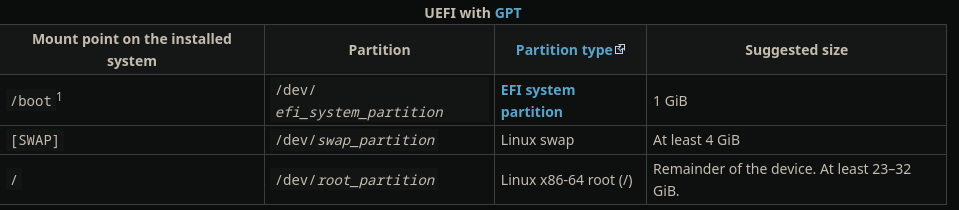
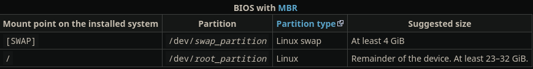

## Preface

The purpose of this article is to provide a comprehensive installation guide to archlinux in a format that is more accessible to you. note that this requires you to already have some knowledge of operating systems. This article summarizes the steps on the arch wiki, and is not intended to be used by everyone.

**hardware requirement**

>CPU architecture: x86_64
>minimun of RAM: 512GiB
>minimun of disk space: 2GiB
>network interface: available

## Guide

### Acquire an installation image

Visit the arch website, look for the desired system version, download the corresponding iso system file, and use gnupg to verify the signature of the downloaded file.

### Verify signature

It is recommended to verify the signature of the iso file before using it,especially when downloading from an HTTP mirror.

After downloading the iso file, in order to verify the signature, you need to first download the corresponding iso signature.

**Use gnupg to run the following command:**
```shell
gpg --keyserver-options auto-key-retrieve --verify archlinux-version-x86_64.iso.sig
```

**Alternatively, from an existing Arch Linux installation run:**
```shell
pacman-key -v archlinux-version-x86_64.iso.sig
```

### Prepare an installation medium

Prepare a large enough storage (size larger than the system iso file can be) of mobile devices, such as: USB flash drive, portable hard disk, etc.. With the help of tools such as ventoy, make the mobile device into a system boot disk.

### Boot the live environment

**Note: Arch Linux installation images do not support Secure Boot.But secure boot can be set up after completing the installation.** 

1、Insert the USB flash drive with the arch system iso file to the physical device, power on the physical device.

2、When the installation medium's boot loader menu appears:

**if you used the ISO, select *Arch Linux install medium* and press Enter to enter the installation environment.**
**if you used the Netboot image, choose a geographically close mirror from Mirror menu, then select *Boot Arch Linux* and press Enter.**

### Set the console keyboard layout and font

**The default keyboard layout is US.**

list all available layout and set the keyboard layout:

```shell
localectl list-keymaps
loadkeys <keyboard-layout>
```

**console fonts are located in /usr/share/kbd/consolefonts/**

set console fonts:

```shell
setfont <font-name>
```

### Verify the boot mode

just run:

```shell
cat /sys/firmware/efi/fw_platform_size
# 64 -->UEFI mode and has a 64-bit x64 UEFI
# 32 -->UEFI mode and has a 32-bit IA32 UEFI
# file not exist -->BIOS
```

### Connect to the internet

**Note:Ensure your Network interface is available.**

```shell
ip link
```

connect the network:
+ Ethernet--plug in the cable
+ Wi-Fi--with tools like **iwctl** or **networkmanager**
+ Mobile broadband modem--connect to the mobile network with the **mmcli** utility

using iwctl to connect network,for example:

```shell
pacman -S iwd
systemctl enable iwd.service
systemctl start iwd.service
```

usage:

**Note: network name should be double quoted when connecting**

```shell
iwctl
#Enter the iwctl environment
[iwd]# ...
#list all available commands
:help
#list all Wi-Fi devices
device list
#turn on corresponding adapter
device <name> set-property Powered on
adapter <adapter> set-property Powered on
#scan availabel neowork nearly
station <name> scan
#list all available neowork
station <name> get-networks
# connect the network
station <name> connect SSID
#connect with passphrase
iwctl --passphrase passphrase station name connect SSID
```

test network connection：

```shell
ping archlinux.org
```

### Update the system clock

In the live environment **systemd-timesyncd** is enabled by default and time will be synced automatically once a connection to the internet is established. 

ensure the system clock is synchronized:

```shell
timedatectl
```

### Partition the disks

```shell
#list available disk devices
fdisk -l
lsblk -f
```

For the selected partitioned disk device, the following partitions are required：
1、root directory -->/
2、EFI system partition -->/boot

using fdisk to modify partition tables:

```shell
fdisk /dev/the_disk_to_be_partitioned
```

**Note:Take time to plan a long-term partitioning scheme to avoid risky and complicated conversion or re-partitioning procedures in the future.**

example layout:





#Format the partitions

**Each partition needs to be properly formatted as a file system.**

some format example:

```shell
#common partition
mkfs.ext4 /dev/root_partition
#swap partition
mkswap /dev/swap_partition
#efi partition
mkfs.fat -F 32 /dev/efi_system_partition
```

### Mount the file systems

**Note:All formatted filesystems should be mounted on /mnt.You must mount the root partition before mounting any other partitions.**

```shell
#root --> /mnt
mount /dev/root_partition /mnt
#boot --> /mnt/boot
mout --mkdir /dev/efi_system_partition /mnt/boot
#swap
swapon /dev/swap_partition
```

### Installation of Arch

**select the mirrors**

**Note:Mirroring prioritizes the mirrors at the top of the file list, scanning the list of mirrors from top to bottom.Choose an appropriate mirror (modification of the corresponding file is necessary).**

The list of mirrors is located in `/etc/pacman.d/mirrorlist`

**install essential packages**

**Note:All software and configuration files installed in the live environment will not appear in the new system after installation.**

Installation of basic packages and firmware programs and kernels：

```shell
pacstrap -K /mnt base linux linux-firmware [vim] [amd/intel ucode] []
```

**Note:If there are any remaining packages that you want to install during the installation of the system, you can add them directly to pacstrap.**

------*At this point, the arch basic installation phase is complete.*------

### Configure the system

#### fstab

```shell
genfstab -U /mnt >> /mnt/etc/fstab
```

**Note:If an error occurs, change the corresponding file manually.**

#### chroot

Exit the live environment and enter the new system:

```shell
arch-chroot /mnt
```

#### time 

```shell
ln -sf /usr/share/zoneinfo/Region/<City> /etc/localtime
#generate /etc/adjtime
hwclock --systohc
```

#### localization

Edit `/etc/locale.gen` and uncomment en_US.UTF-8 UTF-8 and other needed UTF-8 locales.

```shell
locale-gen
#set lang
vim /etc/locale.conf
LANG=en_US.UTF-8
#set keymaps
vim /etc/vconsole.conf
KEYMAP=<layout>
```

#### network configuration

```shell
vim /etc/hostname
<hostname>
```

**Note:Within my other article, this section is covered in detail, just look for the jump to view it!**

#### Initramfs

**Note:Since it's not required, just check the official website for details.**

#### root password

```shell
passwd
```

#### Bootloader

**Note:Within my other article, this section is covered in detail, just look for the jump to view it!**

#### reboot

```shell
reboot
```

## Summary

**There are many more details and precautions in the installation of arch. And, installation is not the most difficult arch, relatively, maintenance arch is always much more difficult than installing arch, it is because arch maintenance is difficult, often due to some irresistible factors, we need to re-install the arch system. Seek more later use and maintenance is decisive.**

## Reference

[Arch installation guide](https://wiki.archlinux.org/title/Installation_guide)

[Arch boot loader](https://www.wensboy.site/2024/11/15/linux-boot-config/)

[Arch network](https://www.wensboy.site/2024/10/29/linux-network-config/)