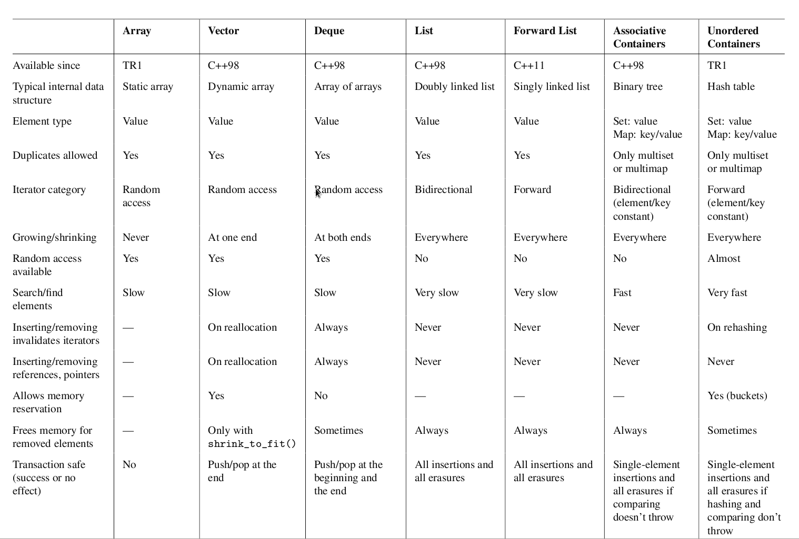
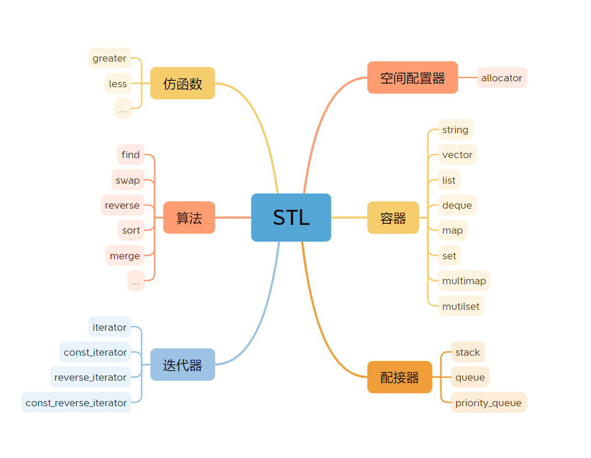
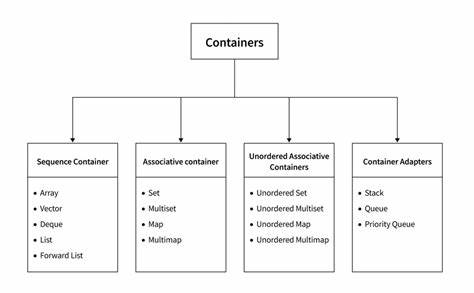

## Preface

When it comes to data structures and algorithms,**C++'s standard template** library can greatly help you speed up your efficiency. However, the standard template library is a very large library, which contains many encapsulated **data structure** templates and **algorithm implementations**, so it is actually a bit difficult to memorize completely, and it is almost difficult to implement, which may be an NP problem. Yes, it seems as if our memories are always limited. Therefore, a good memory is not as good as the memory of a pen, and recording this learning process is also a process of continuous memory.

## Guide

### About STL

**Something about C++ stl**



**STL encompasses the following core concepts**



> Imitation functions
> Algorithm
> Iterator
> Space Configurator
> Containers
> Adapters

Learning priorities are given here:

- [ ] Containers
- [ ] Algorithm
- [ ] Iterator
- [ ] Adapters
- [ ] Space Configurator
- [ ] Imitation functions


 note that this does not necessarily apply to all developers who are learning advanced features of C++. It's a good habit to study selectively according to your needs.


### Containers

**collection of data structures**



Before starting learning containers, you need to add some pre-knowledge such as the use of std::pair, and at the same time, it will also add some extended knowledge in the continuous recording process.


std::pair


```C++
template<class T1,class T2> struct pair{}
first_type --> T1
second_type --> T2

eg:
pair<int,int> first_pair = {1,2};
/*
first_pair.first --> 1
first_pair.second --> 2
*/

/*functions*/

//std::make_pair()
auto p = std::make_pair(T1,T2);

//std::swap()
auto p1 = std::make_pair(10,10);
auto p2 = std::pair(20,9.9);

p1.swap(p2);
/*
p1-->{20,9.9}
p2-->{10,10}
*/

std::swap(p1,p2);
/*
p1-->{10,10}
p2-->{20,9.9}
*/

//std::get(std:pair)
auto p =std::make_pair(9,3.14);
std::get<0>(p);
std::get<1>(p);
std::get<int>(p);
std::get<double>(p);
/*
0 --> first
1 --> second
int --> int_type
double --> double_type
*/

//logic operators
from 0 --> 1 to compare:
auto p1,p2;
if p1>p2 :
    print std::get<0>(p1)>std::get<0>(p2) and std::get<1>(p1)>std::get<1>(p2); 
```

## Summary


## Reference
