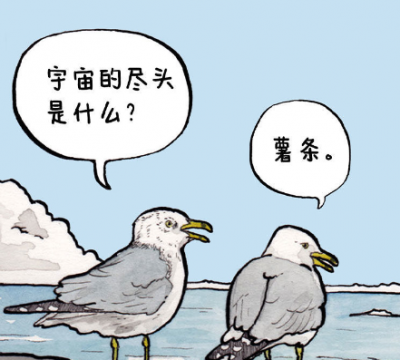

## 前言

生活的最佳状态是冷冷清清的风风火火。--木心

人生是一个很漫长的过程。(至少我是这么认为的) 想要在自己精力旺盛的时候实现一些自己感兴趣，或者说一直存在于心中的执念的想法看起来总是疯狂的。但是，不实现这些，人生又有什么意义？看过cheems的二创视频，是关于人生的，主题大致如下：

很不幸的是，一度被广泛二创的cheems最终也敌不过命运：

人生就是这样。所以，为了减少接下来我人生中的时间的浪费，同时记录一些人生中的难忘时刻，我打算在这里留下一篇随想。

谨以此篇纪念我的同年，那是一段小有遗憾的幸福时光。

## dream

出身平凡，努力成为一个软件工程师，独立开发者。

学习计划：

- [ ] lua
- [ ] shell
- [ ] python
- [ ] c++/c
- [ ] linux
- [ ] docker


持续更新中...


## life

