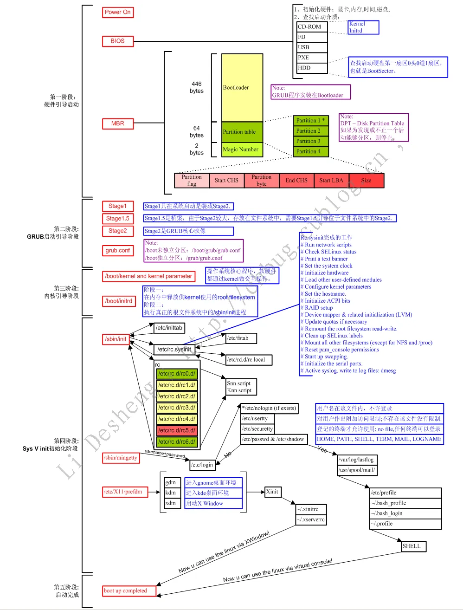
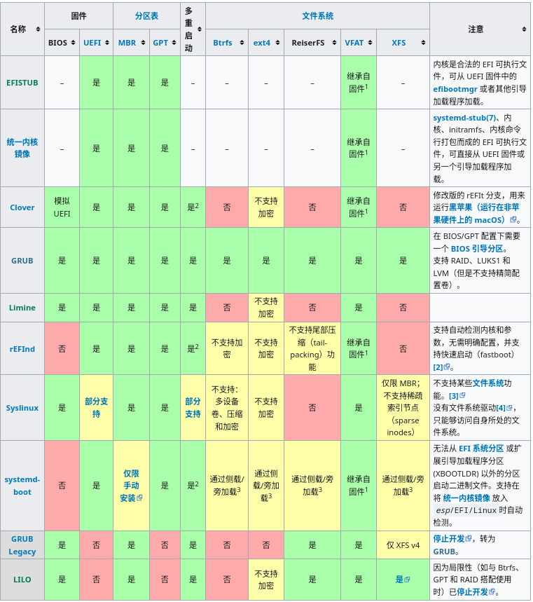

## Preface

After installing linux, we need to boot it. With any luck, you will get a brand new operating system that you can get right into and use. But it seems that we are not always the luckiest ones. Maybe what awaits us is a device with a black screen, and that doesn't seem to be what we want. So we need to avoid this, and under linux, a boot loader is always a must.

## Guide

### Check Firmware Types

Firmware may sound confusing, and it's not. In short, the following two firmware systems are commonly used in modern computers:

> BIOS:Basic Input-Output System(has been replaced progressively since 2010 by the UEFI)
>
> UEFI:Unified Extensible Firmware Interface

### System Initialization

The system turns on, performs a power-up self-test, and initializes the necessary hardware devices. After this, the base firmware scans the corresponding disk partition and finds the corresponding add-in, then starts the bootloader, after which the bootloader loads the kernel and the system using specific parameters.



### Boot Loader

The boot loader is the first software loaded by the computer firmware and is responsible for loading the kernel using specific kernel parameters and initializing the RAM disks according to the configuration file.

**some boot loader(from arch wiki)**



Here we can find a number of bootloaders to choose from, and the applicable characteristics of common bootloaders are also provided here, here we are going to use **grub** as it has the most powerful characteristics and is also one of the most popular bootloader programs.

### Grub

#### Download and Install 

tips:That's always necessary: if you're using an installation media-booted system installation, such as a USB flash drive or other removable media, run `grub-install` after the system has been successfully installed.If you need to install grub outside of a successful installation for some other reason, you'll need to run the option `--boot-directory=/boot` to mount grub to the specified partition.

Installation Procedure：

>1、Mount the EFI partition
>
>2、Select a bootloader logo,like`GRUB`.This will map to the esp/EFI/GRUB directory and be used to distinguish between different efi files
>
>3、Execute the following commands to install the GRUB EFI application grubx64.efi into esp/EFI/GRUB/ and install its modules into /boot/grub/x86_64-efi,just like:
>grub-install --targrt=x86_64-efi --efi-directory=esp --bootloader-id=GRUB

```shell
#I'm using grub on arch, 
#if you're using other distributions,
# looking for specific downloads is necessary!
sudo pacman -S grub efibootmgr
grub-install --target=i386-pc /dev/sdX(Installed disks, not partitions)
```

#### Config

The grub configuration file is located in `/etc/default/grub`, and you need to regenerate the new main configuration file after each modification.

**Generate master configuration file**
Main Configuration File Directory:`/boot/grub/grub.cfg`

Using the tool `grub-mkconfig` to generate the master configuration file:

```shell
grub-mkconfig -o /boot/grub/grub.cfg
```

## Summary

**The boot loader is a very important tool in operating system bootstrapping. It has a direct impact on whether or not the operating system kernel can be boot loaded properly. Of course, for those who have higher needs, using a boot loader to load kernel-specific parameters is also and its important. It is necessary to take a little time to learn more about the advanced features related to grub, as well as some other boot loaders.**

## Reference

[Arch Boot Process](https://wiki.archlinux.org/title/Arch_boot_process#Boot_loader)

[Grub from arch](https://wiki.archlinux.org/title/GRUB)